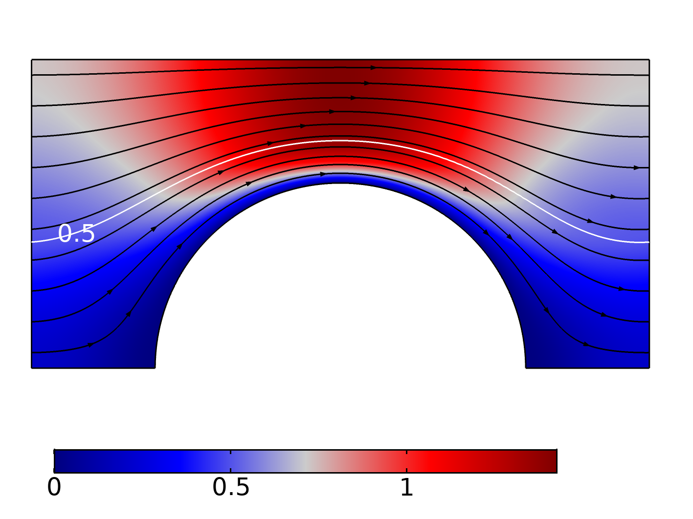
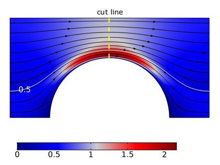

¹French Geological Survey, Orléans, France
²Institut de Mécanique des Fluides de Toulouse, Toulouse, France

\*To whom correspondence should be addressed  

***

# Abstract

In this paper we study the effects of varying permeability on traction terms exerted at the different boundaries for two-phase flow in Hele-Shaw cell. The traction terms, or surface force, are. surface integrals that are necessary to close the continuous macroscopic momentum balance equations for two-phase flow in porous media. These terms are usually modeled from experimental results or obtained by solving a closure problem (a set of boundary value problems to solve on a representative periodic unit-cell). Here these terms are calculated directly by means of direct numerical simulations, and the value of these terms on each interface is studied as a function of the varying permeability and capillary number. We focus on two-phase displacement in high-permeability porous media for which the characteristic flow regimes implies a non-negligible extent of the fluid-fluid interface and thus;  

# Introduction

## Two-phase flow in high-permeability porous media

An accurate description of two-phase flow in high-permeability porous media is of major importance for several practical applications. One can mention, among others, soil remediation in gravely soils [@fetter2017contaminant], nuclear safety [@clavier2017modeling] or hydrodynamic of catalytic fixed bed reactors [@Santos1991]. However, most of the literature is dedicated to two-phase flow in low-permeability porous media.

Due to the larger pore size, two-phase flow in high-permeability porous media (hereafter, high-permeability porous media refers to media for which the characteristic particle diameter is about one millimeter and above) results in a complex interaction between capillary, gravity and viscous forces [@davit2018one]. For low-permeability porous media, the flow is usually dominated by surface tension force, i.e. the capillary number is low (usually inferior to $10^{-3}$), and the fluid repartition pattern is well described as two independent flow streams separate by a multitude of stable meniscus at steady state, as illustrated in +@fig:fluidPatterns (a) [@dullien2012porous]. This regime is characterized by the small extent of the fluid-fluid interface, as the fluid phases are segregated, with the wetting phase flowing into the larger pores while the wetting phase occupies the smaller pores. In contrast, for high permeability porous media, the flow is no longer capillary-dominated and the viscous forces become significant (also gravity and inertial effects may become important if Bond and Reynolds numbers are high, respectively). Thus the fluids repartition patterns can take two forms, either the non-wetting phase is continuous, see as an example +@fig:fluidPatterns (b), or is flowing as droplets or ganglia, as in +@fig:fluidPatterns (c). For these two options, the wetting phase is flowing as a film in contact with the solid and the non-wetting phase flows at the center of the pores surrounded by the wetting phase. One can note that these flow regimes are analogous to those observed in gas-liquid flows in a tube (annular flow, bubbly flow, etc.) [@taitel1976model]. Strictly speaking, these different regimes must be considered when attempting to describe two-phase flows with continuous macroscopic equations. Indeed, it has been shown several times that the overall flow properties depend on the flow regimes [@Avraam1995a; @armstrong2016beyond]. 
At first glance, one would consider that the exchange terms between the fluids, through their common surfaces, as negligible compared to their counterpart between the fluid phases and the solid phase for surface-tension dominated flow since the extent of the fluid-fluid interface is small. On the other hand, and this is what we are interested in here, this is not necessarily the case for regimes specific to flow in high-permeability porous media for which the extent of the fluid-fluid interface is large. This is important because, as discussed in the next section, these exchange terms between phases are the basis of any attempt to establish continuous relationships on a macroscopic scale starting from the pore scale.

![Illustration of possible fluids dispatching in a 2D porous network with solid phase in black, fluid 1, that stands for the non-wetting phase (gray) and the wetting fluid (white), (a) the two fluids are flowing in different channels separate by numerous meniscus (b) wetting and non-wetting fluid are flowing together in most of the pores as two continuous streams and (c) both fluids are flowing together in most of the pores and the non-wetting phase is discontinuous - Adapted from [@dullien2012porous]](figures/emf/dessin.emf){#fig:fluidPatterns}

## Continuous model

Volume averaged microscopic equation of motion for two Newtonian fluids $i,j=o,w\:\mathrm{and}\:i\neq j$ reads 

$$
\rho_{i}\varepsilon_{i}\left(\frac{\partial\mathbf{U}_{i}}{\partial t}+\mathbf{U}_{i}\cdot\nabla\mathbf{U}_{i}\right)=-\varepsilon_{i}\nabla P_{i}+\varepsilon_{i}\rho_{i}\mathbf{g}+\varepsilon_{i}\nabla\cdot\boldsymbol{\tau}_{i}+(\mathbf{F}_{ij}+\mathbf{F}_{is})
$$ {#eq:averagedMomentum} 

where $\varepsilon_{i}=V_i/V$ is the volume fraction of the $i$-fluid and $V$ is a representative elementary volume, $U_i$ is the intrinsic average velocity of the $i$-fluid, $P_i$ is the average pressure of the $i$-fluid, $\boldsymbol{\tau}_{i}$ denotes the average viscous stress tensor. The last two terms in the left hand side denote the force of interaction per unite volume exerted by fluid $i$ upon fluid $j$ and the force of interaction exerted by fluid $i$ upon the solid phase, respectively [@Kalaydjian1987]. 

From there, there are two possible ways to solve +@eq:averagedMomentum and the associated equations. In volume averaging litterature, one seeks to express the terms of interaction between the phases with averaged quantities and to recast equation +@eq:averagedMomentum in a form similar to Darcy's law (equation for creeping saturated single-phase flow in porous media). Indeed, by considering creeping two-phase flow +@eq:averagedMomentum can be written as

$$
0=-\varepsilon_{i}\nabla P_{i}+\varepsilon_{i}\rho_{i}\mathbf{g}+\frac{1}{V}\int_{A_{is}+A_{ij}}\mathbf{n}_{i}\cdot\left(-\mathbf{I}p_{i}+\mu_{i}\left(\nabla\mathbf{u}_{i}+\left(\nabla\mathbf{u}_{i}\right)^{T}\right)\right)\mathrm{d}A.
$$ {#eq:VAmomentum}

where $p_i$ and $u_i$ are microscopic pressure and velocity fields of fluid $i$, respectively. By expressing the surface integrals in term of averaged quantities one can obtain the following momentum balance equations,

$$
\mathbf{U}_{i}=-\frac{1}{\mu_{i}}\mathbf{K}_{ii}^{*}\cdot(\nabla P_{i}-\rho_{i}\mathbf{g})-\frac{1}{\mu_{j}}\mathbf{K}_{ij}^{*}\cdot(\nabla P_{j}-\rho_{j}\mathbf{g}),\quad i,j=o,w\:\mathrm{and}\:i\neq j,
$$ {#eq:darcyCross}

in which $\mathbf{K}_{ij}^{*}$ are the coupled relative permeability tensors that pertain to the interaction between the fluids [@Whitaker1986a;@Lasseux1996].

The reader is warned that +@eq:darcyCross has, to our knowledge, never been used in practice to model two-phase subsurface flows. On the contrary, the ubiquitous continuous model used to describe two-phase flows in soils is based on a direct extension of the Darcy's equation and the whole model, also known as Muskat equations [@wyckoff1936flow;@muskat1938flow], reads

$$
0=\frac{\partial\varepsilon S_{i}}{\partial t}+\nabla\cdot\mathbf{U}_{i},\quad i=o,w,
$$ {#eq:darcyContinuity}

$$
\mathbf{U}_{i}=-\frac{1}{\mu_{i}}\mathbf{K}_{i}\cdot(\nabla P_{i}-\rho_{i}\mathbf{g}),\quad i=o,w,
$$ {#eq:darcyMomentum}

$$
1=S_{w}+S_{o}
$$ {#eq:darcySaturation}

$$
\mathbf{K}_{w}=\mathbf{K}k_{rw}(S_{w}),\qquad\mathbf{K}_{o}=\mathbf{K}k_{ro}(S_{w}),
$$ {#eq:darcyConstitutiveRel}

$$
P_{c}(S_{w})=P_{o}-P_{w}.
$$ {#eq:darcyPc}

where $\mathbf{K}$ is the absolute permeability tensor. The generalization toward two-phase flows involves the introduction of the relative permeability terms $k_{ri}$ which account for the division of the void space between the fluids [@dullien2012porous], thus the relative permeability depends (non-linearly) only on the saturation. To close the set of the macroscopic equations a constitutive relation between the macroscopic pressure of each fluid has to be furnished. This relation is known as the capillary pressure relation and, as for the relative permeabilities, is supposed to depends non-linearly only on the saturation [@leverett1941capillary]. 

A significant amount of work attempted to make improvements to the Muskat equations (e.g. including moving contact line [@kalaydjian1992dynamic;@Hassanizadeh1993;@barenblatt2003mathematical] or take into account the trapped phases [@hilfer1998macroscopic]). Here we would only stress that the concept of relative permeabilities into the Muskat equations is dedicated to independent flow pathways only [@blunt2017multiphase] and the underlying assumption that the two streams do not interfere with each other, a situation far from the regimes previously identified for high permeability porous media. Thus +@eq:darcyMomentum does not take into account the interaction between the fluids as opposed to +@eq:darcyCross. If the former is used to the detriment of the latter, it is mainly because the literature on subsurface flow is focused on oil recovery applications, for which the permeability is very low and the independent streams regime is a good approximation.

Another approach is to implement  +@eq:averagedMomentum and provide constitutive relations for the interaction terms between the phases. These relations are usually obtained through interpretation of experimental data. Some results, focusing on relation for the interaction between the fluid phases, are given in the next section as well as results in literature for coupled permeabilities from the porous medium approach. 

### Modeling of the interaction between fluids

Based on the generalized Darcy law with coupled terms +@eq:darcyCross, experimental works computed the coupled transport coefficient through steady-state cocurent flow in sandpack with one fluid, and alternatively the other, which is submitted to a null pressure gradient. This protocol was used with oil and water in a cylindric sandpack [@zarcone1994determination] and the authors found a negligible effect of the coupled permeabilities in the overall flow. With  the same protocol, with oil and water in a 2D-sandpack Dullien and Dong [@Dullien1996] found that the coupled permeabilities are important since they can contribute at best to 35% of the effective permeability. Alternatively, authors imposed [@ramakrishnan2015measurement] a null displacement and measured the induced pressure drop, with air and water in a Berea sandstone core they found that the coupled transport coefficients must not be overlooked for intermediate saturations. Several authors conducted experiments with two different set-ups as proposed by Rose [@Rose1988], e.g. [@bentsen1993use], in which the authors made cocurrent and countercurrent experiments with water and oil in a sandpack and found that coupled permeabilities reach, at least, 15% of the effective permeability value. However, it was pointed out that the saturation between the two sets of experiments can be very different and therefore the computed relative permeabilities can not be safely compared [@langaas2001numerical]. The effect of the non-wetting phase connectivity on the transport parameters was extensively studied in [@Avraam1995], the authors performed steady-state cocurrent two-phase flow in 2D-micro model experiments and found that the contribution of the coupled permeabilities on the flow is non-negligible and depend on the flow regimes.

Several numerical studies investigated the share of the coupled permeabilities in the effective permeability. The seminal work of Rothman [@Rothman1990] examined the question by conducting two-phase flow simulations in simple geometries with the immiscible lattice-gas method. The author found non-negligible participation of the coupled permeabilities by applying the volume force alternatively on each fluid. Numerous authors used the lattice-Boltzmann method, such as [@Li2005], in which the authors examined the value of the coupled permeabilities as a function of the saturation in a 3D-sphere pack and they found results in agreement with Rothman's results. In [@Yiotis2007] the authors used a lattice Boltzmann method in 2D and 3D pore networks and found a non-wetting apparent relative permeability greater than unity when the wetting fluid is more viscous than the non-wetting fluid. This result is a manifestation of the lubrification effect, also observed in experiments [@odeh1959effect], and arising because of strong hydraulic coupling between the fluids. Recently, in [@shams2018study], the authors have used a Volume Of Fluid method to study the transport coefficients of fluid layers in non-circular capillary tubes. Based on analogy with a model Couette flow the authors have derived simple relations that can predict with good accuracy the transport coefficients, including the coupled ones, of fluid layers. We can also refer to recent work in which a whole analytical model is given for one-dimensional two-phase flow in coarse non-consolidated porous media and which correctly predicts the pressure loss in a debris bed [@clavier2017modeling]. 

Several correlations from theorical analysis for the fluid-fluid force interaction have been derived in  hydrodynamic of TBR litterature. These correlations usually relate the momentum exchange between the fluids to the flow velocity and the medium properties with Ergun's like relations. For example, Attou et al. [@Attou1999] found that the drag between the fluids can be expressed as follows

$$
F_{lg} = A_{lg} U_r + B_{lg} U_r^2,
$$

where the relative velocity is given by $U_r=U_g-\frac{S_g}{S_l}U_l$ and $A_{lg}$ and $B_{lg}$ are coefficients that depend on the volume fraction of the gas phase and the medium properties. The subscripts $g$ and $l$ denote the gas phase and the liquid phase, respectively. This type of model with explicit account of interaction between fluids, see also [@tung1988hydrodynamic;iliuta2005modelling], gives good results when compared with experimental results [@wang2013modelling]. 
 
## Outline of the study

# Theoretical background

## Macroscopic quantities

In the following, the superficial average of a physical quantity $\theta_i$ associated with the $i$-phase is given by

$$
\left\langle \theta_{i}\right\rangle =\frac{1}{V}\int_{V_{i}}\theta_{i}\:\mathrm{d}V.
$$ {#eq:superficialMean}

Macroscopic quantities such as saturation and intrinsic average pressure for two fluids $i=w,o$ read

$$
S_i = \frac{1}{V} \int_{V}\chi_{i}\;\mathrm{d}V
$$ {#eq:saturation}

and

$$
P_{i}=\frac{\int_{V}p\chi_{i}\;\mathrm{d}V}{\int_{V}\chi_{i}\;\mathrm{d}V},
$$ {#eq:intrinsicMeanPressure}

respectively. In these equations $V$ is the volume accessible to the fluids, that is the pore volume, and $\chi_i$ is the phase indicator of the i-fluid (scalar function that takes the value 1 in the fluid and 0 elsewhere). The quantity $\int_{V}\chi_{i}\;\mathrm{d}V$ is the volume fraction of the i-fluid that is $\varepsilon_{i}$ as already introduced in the previous section. 

Then we can introduce the dynamic capillary pressure defined as the difference of the intrinsic mean pressures, 

$$
P_{c}=P_{o}-P_{w}.
$$ {#eq:darcyPc}

## Traction terms

As said, an essential step in order to derive some macroscopic law at macroscale from the microscale is to use averaged quantities to express the boundary intergals terms that arising because of the averaging theorem application [@Whitaker2013]. Remember that these closure relations are not presented here but rather we leave intact the surface integrals, the averaged momentum balance equations +@eq:VAmomentum for two fluids $w$ and $o$, are recast as

$$
0=-\varepsilon_{w}\nabla P_{w}+\mathbf{T}_{wo}+\mathbf{T}_{ws}, 
$$

$$
0=-\varepsilon_{o}\nabla P_{o}+\mathbf{T}_{ow}+\mathbf{T}_{os},
$$

where $\mathbf{T}_{ij}$ are the traction (name given to surface forces in the Boundary Integral Methods literature in which these integrals are central) exerted by fluid $i$ upon fluid $j$ and $\mathbf{T}_{is}$ the traction exerted by fluid $i$ upon the solid [@Kalaydjian1987]. The traction terms are written as 

$$
\mathbf{T}_{ij}=\frac{1}{V}\int_{A_{ij}}\mathbf{n}_{ij}\cdot\left(-p_{i}\mathbf{I}+2\mu_{i}\mathbf{e}_{i}\right)\mathrm{d}A,
$$

where $\mathbf{n}_{ij}$ is the normal vector at the interface and pointing toward the j-phase, $p_{i}$ the pointwise pressure of the fluid $i$ and $\mathbf{e}_{i}=\frac{1}{2}\left(\nabla\mathbf{u}_{i}+\left(\nabla\mathbf{u}_{i}\right)^{T}\right)$ the rate-of-strain tensor for Newtonian fluids with $\mathbf{u}_{i}$ the pointwise velocity of fluid $i$.

## Theory of two-phase displacement in Hele-Shaw cell

Two-phase flow between two parallel plates under study here is illustrated in +@fig:modelStudy. This represents a cocurrent flow of two fluids inside a Hele-Shaw cell parallel to the $x-y$ plane, with the $z$-axis perpendicular to the plates, and for which $h$ is the aperture between the plates. A solid obstacle of circular cross-section is sandwiched between the two plates. Tangential (cell plane) stress, as well as stress arising from the perpendicular confinement, need to be taking into account to properly describe the flow. The important parameter here are the aspect ratio $h/l$ where $l$ is some characteristic transverse length (hereafter $l$ is the cell width as shown in +@fig:modelStudy) and the capillary number. 

{#fig:modelStudy}

To compute the traction exerted by the fluids upon the cell plates we need to consider that the velocity profile in the $z$-direction is well described by the Poiseuille flow profile, 

$$
u=-\frac{1}{2\mu}\frac{dp}{dx}z(z-h).
$$ {#eq:poiseuilleProfile}

Then the friction force exerted on the bottom plate is given by

$$
\mu\frac{\partial u}{\partial z}\mid_{z=0}=-\frac{h}{2}\frac{dp}{dx}.
$$ {#eq:poiseuilleFriction}

Thus, the traction $T_{i,pl}^x$ is obtained by multiplying the friction force by two times the surface wetted by the fluid $i$.

We note that the average velocity taken over the interval between the plates is written as follows 

$$
\mathbf{U}(x,y,0)=-\frac{h^{2}}{12\mu}\nabla_{\parallel}p.
$$ {#eq:darcyHeleShaw}

There is therefore a direct analogy between flows in a 2D porous medium and flow in a Hele-Shaw cell, as can be seen in +@eq:darcyHeleShaw, where the permeability is given by $h^{2}/12$ [@saffman1958penetration]. 

Beside the interface curvature in the Hele-Shaw cell plane, the meniscus in the perpendicular plane must be taken into account. Therefore, the pressure jump at equilibrium across the interface reads

$$
\Delta p = \gamma \left(\frac{2}{h}+\kappa_{\parallel}\right),
$$ {#eq:dP}

where $\gamma$ denotes the surface tension and $\kappa_{\parallel}$ the curvature in the Hele-Shaw plane [@saffman1958penetration]. The +@eq:dP was completed in [@park1984two] by an additional term that pertains for dynamic film formation and a corrective $\pi/4$ factor for the curvature in the cell plane. The reader is warnes that while dynamic film formation along the plates is an important phenomenom regarding the flow [@jackson2015dynamic], this requires dedicated study and is beyond the scope of this article. Thus, we consider in the following that the invading fluid is in contact with the cell plates, i.e. presence of a triple line.

# Direct numerical simulations

## Equations

### Level Set model

We use the Level Set method to capture the moving free interface between the fluids. In this framework the fluid phases are identified with a level set (scalar) function that goes smoothly from 0 to 1 across the fluid interface and the interface is implicitely defined as the iso-level $\phi=0.5$. The transport of the level set function $\phi$ is governed by

$$
\frac{\partial\phi}{\partial t}+\nabla\cdot(\mathbf{u}\phi)=\tau\nabla\cdot\left(\psi\boldsymbol{\nabla}\phi-\phi(1-\phi)\frac{\boldsymbol{\nabla}\phi}{\vert\nabla\phi\vert}\right).
$$ {#eq:advecphi}

In this equation, $\mathbf{u}$ is the velocity field, $\tau$ and $\psi$ are two numerical parameters that control the diffuse interface thickness and the amount of reinitialization of the $\phi$ function, respectively [@Olsson2005;@Olsson2007]. 

### Flow equations

Remember that we need to take into account tangential stress as well perpendicular stress due to the flow confinement, a full-3D resolution of the flow equations would be meaningful. In order to avoid solving such resource-intensive simulations we rather resolved 2D flow equations plus an additional term taking into account the perpendicular stress. The velocity and pressure fields are obtained by solving the 2D-modified Stokes equations since the Reynolds number is assumed to be sufficiently low so that the flow is creeping, the whole-domain formulation Stokes and continuity equations read

$$
0=-\nabla p+\mu(\phi)\left(\nabla^{2}\mathbf{u}-k^{2}\mathbf{u}\right)+\mathbf{F}_{st},
$$ {#eq:StokesMomentum}

$$
0=\nabla\cdot\mathbf{u},
$$ {#eq:StokesContinuity}

where $k=\frac{\sqrt{12}}{h}$ is an additional term that pertain to a Darcy-term arising from the depth-averaging of the Stokes equation, as described in the theoretical background section and $\mathbf{F}_{st}$ is the capillary contribution. The capillary contribution is difficult to compute in volumetric methods such as Level Set and is itself the object of a large body of work [@Popinet2018], this term is defined here as 

$$
\mathbf{F}_{st}=\gamma\kappa\delta(\phi)\mathbf{n},
$$ {#eq:Fst}

where $\gamma$ is the surface tension, $\kappa$ is the interface mean curvature, $\mathbf{n}$ denotes the unit normal to the interface and $\delta(\phi)$ is the Dirac delta function localized on the interface [@Galusinski2008]. In this framework the unit normal vector as well as the mean curvature are obtained with the level set function $\phi$ as 

$$
\mathbf{n}=\frac{\boldsymbol{\nabla}\phi}{\vert\boldsymbol{\nabla}\phi\vert},
$$

$$
\kappa=\frac{\pi}{4}\nabla\cdot\left(\frac{\boldsymbol{\nabla}\phi}{\vert\boldsymbol{\nabla}\phi\vert}\right)+\kappa_{\perp},
$$

respectively, where the $\pi/4$ correction was derived in [@park1984two] and $\kappa_{\perp}=\frac{2}{h}$ is the out-of-plane curvature as described previously in the theoretical background section.

The material parameters, that is the fluid density and the fluid viscosity, varies smoothly from one fluid to another 

$$
\rho(\phi)=\rho_{o}+(\rho_{w}-\rho_{o})\phi,
$$

$$
\mu(\phi)=\mu_{o}+(\mu_{w}-\mu_{o})\phi.
$$

### Dimensionless equations and relevant dimensionless numbers

If one define the following dimensionless variables

$$
\mathbf{u}=\mathbf{u}'\times U,\;p=p'\times\frac{\mu U}{l},\;\kappa=\kappa'\times l,\;\mathbf{x}=\mathbf{x}'\times l,
$$

where $U$ is a reference velocity, $\mu$ a reference viscosity and $l$ a reference length, Stokes and continuity equations can be recast as

$$
0=-\nabla'p'+\frac{\mu(\phi)}{\mu}\nabla'^{2}\mathbf{u}'+\frac{\gamma}{\mu U}\kappa'\nabla'\phi,
$$

$$
0=\nabla'\cdot\mathbf{u}'.
$$

One can notice the two following dimensionless numbers

$$
\bar{\mu}=\frac{\mu(\phi)}{\mu},\;Ca^{-1}=\frac{\gamma}{\mu U},
$$

the viscosity ratio and the capillary number, respectively, which add up to the already identified aspect ratio $h/l$.

## Test case 

### Geometry and boundary conditions

We study a model system consisting of an array of cylinders in a thin square cuboid, resembling a Hele-Shaw-cell with obstacles, as shown in +@fig:model. The two fluids are injected from the left at a constant normal velocity. The outlet boundary condition for the flow is a constant pressure. Initially the wetting fluid occupy the entire model as depicted in +@fig:model. The different boundary conditions are listed in +@tbl:BC.

{#fig:model}

Boundary | u 						| p   |$\phi$
-------- | ------------------------ | --- | ---
$A_{ws}$ | 0 						| -   | $\mathbf{n}\cdot\mathbf{u}\phi=0$
Outlet 	 | - 						| 0   | $\mathbf{n}\cdot\boldsymbol{\nabla}\phi=0$
Inlet o  | $U_{o}^{x}=\mathrm{cst}$ | -   | 0
Inlet w  | $U_{w}^{x}=\mathrm{cst}$ | -   | 1

Table: Boundary conditions used. {#tbl:BC}

# Results

The results are given as a function of the dimensionless numbers defined previously. The reference length $l$ is the width of the unit cells (0.5 mm), the reference viscosity is the invading fluid viscosity that is two times greater ($\mu_o=2\times 10^{-3}$ Pa.s) than the wetting fluid viscosity. and the reference velocity is the total velocity, that is $U=U_{o}+U_{w}$. In consequence the capillary number and the dimensionless inlet velocity read

$$
Ca=\frac{(U_{o}+U_{w})\mu_{o}}{\gamma},\;U_{w}^{'}=\frac{U_{w}}{U_{o}+U_{w}}=f_{f},\;U_{o}^{'}=1-f_{f},
$$

respectively, where $f_{f}$ is the fractional flow. In the following the viscosity ratio $\bar{\mu}$ as well as the fractional flow $f_{f}$ are kept constant at 2 and 0.25, respectively.

In the following, the intrinsic permeability of the model is varied by modifying the aperture between the two plates of the cell. We use five different values for the aperture and the correspondence in terms of intrinsic permeability is given in +@tbl:permeability from single-phase simulation. When $h\rightarrow\infty$, it is expected that the intrinsic permeability tends towards the permeability obtained with purely 2D flow equations, this can be verified in +@fig:permeability. We obtain intrinsic permeability values typical of high permeability porous media with the selected aperture values. 

$l/h$ | $h^2/12$ (darcy) 	| $k$ Simulation (darcy) 
----- | ------------------- | --- 
0.2   | $5.21 \times 10^{5}$| $1.48 \times 10^{4}$ 
2      | $5.21 \times 10^{3}$| $2.85 \times 10^{3}$ 
4     | $1.30 \times 10^{3}$| $8.63 \times 10^{2}$ 
8    | $3.26 \times 10^{2}$| $2.35 \times 10^{2}$ 
20	  | $5.21 \times 10^{1}$| $3.94 \times 10^{1}$

Table: Equivalence between the value of the cell plates aperture and the intrinsic permeability of the model obtained either from the intrinsic permeability for flow between two plates or from single-phase simulation.  {#tbl:permeability}

{#fig:permeability}

## Wetting fluid saturation decreases when permeability is decreasing

Before we turn to the study of traction terms it is worth invesigate the effect of varying permeability on the fluid repartition and the velocity fields. Wetting fluid saturation in the third unit-cell (UC3), computed accordingly to +@eq:saturation, is given as a function of the dimensionless aperture between the plates in +@fig:saturation.

The wetting fluid saturation non-linearly decreases with $h^*$ and stays at moderate values, between 0.6 and 0.3. A smaller capillary number tends to slightly increase the wetting fluid saturation at steady-state. 

{#fig:saturation}

Let us take a closer look at the interface position for different values of $h^*$ for $Ca=1$ and $Ca=0.05$ in +@fig:interfaceCa1 and +@fig:interfaceCa005, respectively. The interface for small capillary number and large aperture is significantly flatter than for high capillary number and/or small aperture. One also noted that the interface is symmetrical when the capillary number is large whereas it loses this property for a smaller capillary number and for larger aperture between the plates. On the same plots we show the position of the interface in a purely 2D case, and one can see that it is very close to the solution for $1/h^*=0.2$. The fluid-fluid interface moves closer to the cylinder for decreasing aperture (i.e. intrinsic permeability), this has an impact on the velocity fields, as shown in +@fig:UvelocityCa1LH2 and +@fig:UvelocityCa1LH20, which represent the dimensionless $x$-component of the velocity for $Ca=1.0$ and $1/h^*=2$ and $1/h^*=20$, respectively. Clearly, what is happening here is that the velocity profile is close to the Poiseuille profile as long as the interface is not too close from the solid. To verify this, we plot in +@fig:uprofileCa1 the dimensionless $x$-component of the velocity
 along the line shown in +@fig:UvelocityCa1LH20. The profile for the pure 2D solution ($h\rightarrow\infty$) resembles a Poiseuille profile while for decreasing aperture the maximum velocity is observed between the solid and the fluid-fluid interface.

{#fig:interfaceCa1}

{#fig:interfaceCa005}

{#fig:UvelocityCa1LH2}

{#fig:UvelocityCa1LH20}

{#fig:uprofileCa1}

## Dynamic capillary pressure scale linearly with the gap between Hele-Shaw plates regardless of the capillary number

We now consider the dynamic capillary pressure as defined in +@eq:darcyPc as a function of $h^*$. As can be seen on +@fig:Pc, $P_c$ perfectly scales linearly with $h^*$, regardless of the capillary number. One can find on the same plot the theoretical pressure jump across the fluid-fluid interface due to the out-of-plane meniscus. This pressure jump closely matches the computed dynamic capillary pressure and to this point, we can conclude that even for the largest aperture the difference of mean intrinsic pressure is given by the meniscus between the two plates. Seeing this, it is worthwhile to contrast the pressure jump across the interface with the pressure gradient across the cell. We plot the pressure field and pressure contour in the third unit-cell (UC3) for $Ca=1$ and $1/h^*=2$ on +@fig:pFieldCa1 (a) and $1/h^*=20$ on +@fig:pFieldCa1 (b). One can note that, although the pressure jump is greater in absolute terms, it is almost unobservable for the smallest aperture because of the large pressure gradient.

{#fig:Pc}

{#fig:pFieldCa1}

{#fig:pFieldCa001}

## Fluid-fluid traction increases faster compared to solid-fluid traction when permeability is decreasing 

Here we plot traction terms as a function of the aperture between the Hele-Shaw plates. We first plot on +@fig:drag_plates traction exerted on the Hele-Shaw plates by each fluid, remember that this term is computed as described in the theoretical background section. Logically, the traction exerted by the non-wetting fluid on the cell plates becomes more important for smaller aperture since, as discussed above, the surface wetted by this fluid becomes larger as the aperture decreases. 

{#fig:drag_plates}

In +@fig:drag_solid we plot the sum of traction ($x$-component) exerted on all solid-fluid boundaries as a function of the dimensionless aperture between the plates  and for different capillary numbers. For $1/h^*$ greater than 2, the traction scale a bit slower than $1/h^2$. Logically, the greater the capillary number, the greater the traction term.

{#fig:drag_solid}

We compute the fluid-fluid traction $T_{ij}$ in two steps. The first step concerns the viscous part of the stress tensor, which is calculated directly from the velocity gradients available on the interface contour. The second step concerns the pressure part, which is obtained by applying the divergence theorem on each phase into UC3. In +@fig:drag_fluidint we plot the traction on the fluid-fluid interface $T_{ow}$ as a function of $h^*$. From $1/h^*=2$ the traction scale a bit faster than $1/h^2$.

{#fig:drag_fluidint}

## Decreasing the intrinsic permeability does not imply that the share of the fluid-fluid traction is negligible in the total traction

Let us now sum up all the traction terms and answer the question of the share of traction exerted on the fluid-fluid boundaries in total traction. The ratio $T_{int}^x/T_{s}^x$ is given as a function of the dimensionless aperture between the Hele-Shaw plates in +@fig:ratioDrag. The traction exerted on the fluid-fluid boundary reaches between 10 and 50% of the traction exerted on the solid-fluid boundaries. Interestingly, the ratio varies non-monotonically with $h^*$, the minimum is reached for the smallest capillary numbers and a medium range of the aperture values.  

Variations with aperture between plates are amplified as the capillary number decreases. Thus, it is for the lowest capillary number tested that we obtain both the maximum and minimu
m values of the ratio $T_{int}^x/T_{s}^x$. 
 
{#fig:ratioDrag}

# Conclusion

In this work, we investigated the effect of varied permeability on cocurrent two-phase flow in a Hele-Shaw cell. We focused on the value of the traction terms, that are necessary to close the macroscopic flow equations. The idea of solving modified 2D-Stokes equations with a supplementary Darcy term allowed us to modify the intrinsic permeability of the structure without having to modify the geometry per se. The range of intrinsic permeability values investigated is typical of high-permeability porous media, for which it is known that the flow regimes are characterized by the large extent of the fluid-fluid interface (e.g. film flow). With direct numerical simulations we found that 

# Appendix

## Validiation against explicit tracking interface method

The code is validated by comparison with a Boundary-Element Method, which relies on a surface discretization of the interface and a pseudo-analytical formulation in the bulk of the phases. This allows us to precisely locate the interface, even in the case of very thin film flow, and to carefully analyze the choice of parameters in Eq. [eq:advecPhi].

The test case resembles the study case as it consists of the injection of a fluid into a Hele-Shaw initially fully saturated with a flowing fluid. The dynamic viscosity of the fluids is equal and the model is illustrated in +@fig:testCase.

{#fig:testCase}

# References