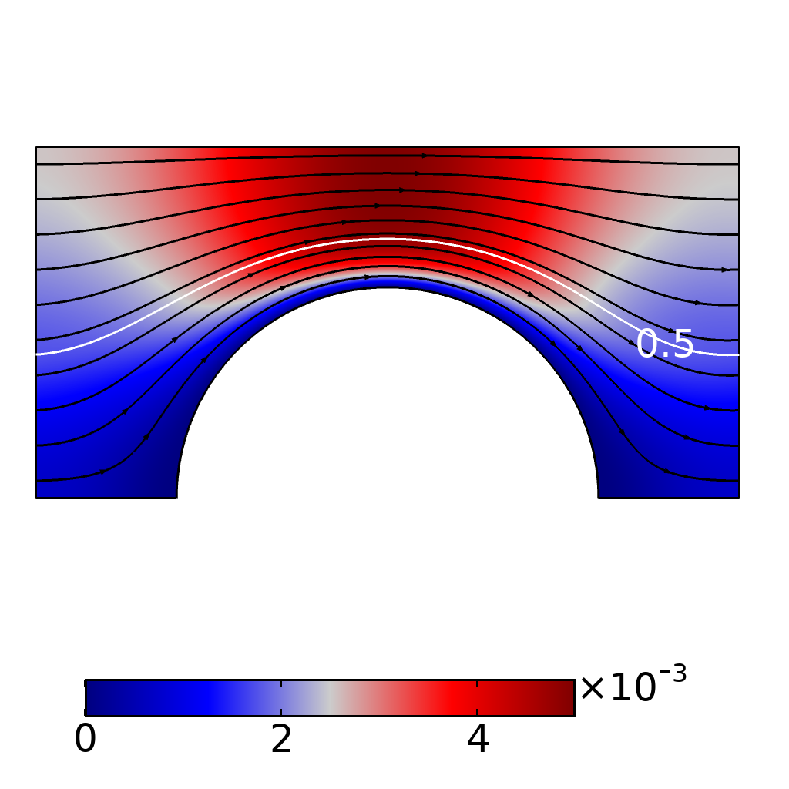
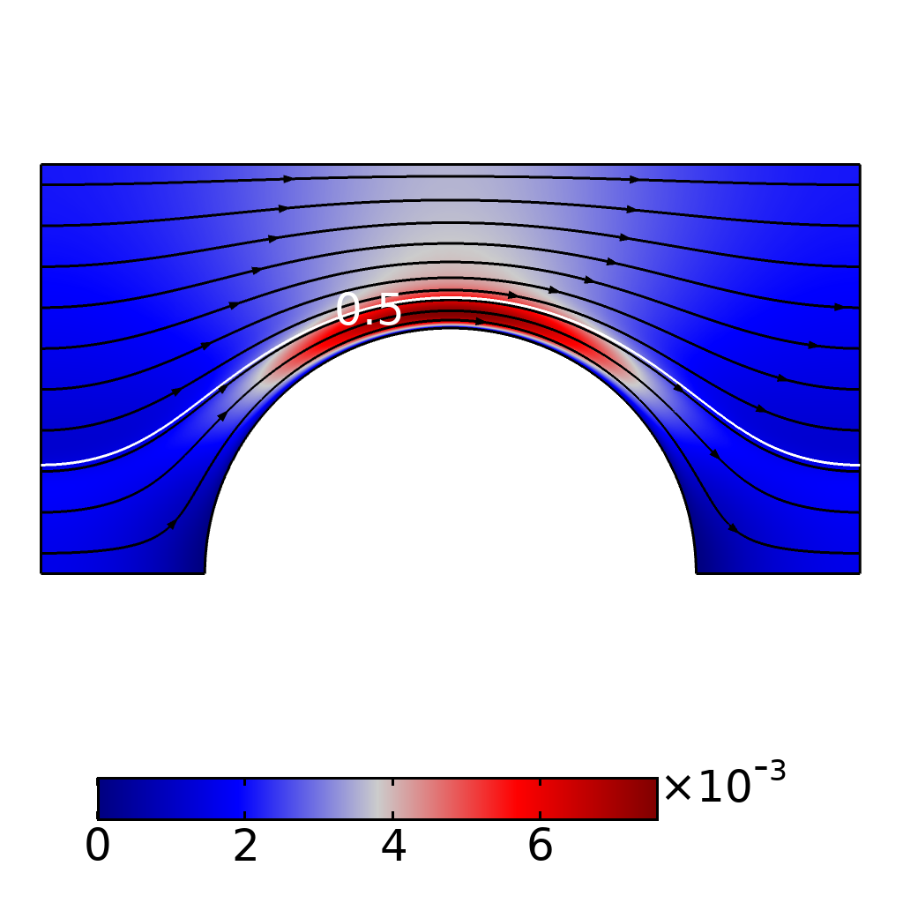

¹French Geological Survey, Orléans, France

\*To whom correspondence should be addressed  

***

# Abstract

# Introduction

## Two  phase flow in high permeability porous media

Accurate description of two-phase flow in high permeability porous media is of major importance for several practical applications. One can mention, among others, soil remediation in gravely soils [@fetter2017contaminant], nuclear safety [@clavier2017modeling] or hydrodynamic of catalytic fixed bed reactors [@Santos1991]. However, most of the literature is dedicated to two-phase flow in low permeability porous media.

Due to the larger pore size, two-phase flow in high-permeability porous media (hereafter, high-permeability porous media refers to unconsolidated media for which the characteristic particle diameter is about one millimetre and above) results in a complex interaction between capillary, gravity and viscous forces. Because of these complex interplay, the characteristic flow regimes are very different from those observed for surface tension dominated flow [@dullien2012porous]. For low permeability medium, if the surface tension between the fluids is not too low and the viscosity not too high, that is the capillary number is low (usually inferior to $10^{-3}$), the fluid repartition pattern is described as two independent flow streams separate by a multitude of stable meniscus at steady state, as illustrated in +@fig:fluidPatterns (a). In this case, for a completely wet medium, wetting phase flows in the small pores while the non-wetting phase tends to occupy the larger pores. For high permeability porous media, the fluid velocity can be high enough that the viscous forces dominate over capillary forces (alike gravity and inertial effects may become important if Bond and Reynold numbers are high, respectively). Thus, the fluids repartition patterns can take two forms, either the non-wetting phase is continuous, see for example +@fig:fluidPatterns (b), or flows as droplets or ganglia as in +@fig:fluidPatterns (c), while the wetting phase flows as a film in contact with the solid matrix. In both cases, the two fluids occupy most of the pores at the same time and the non-wetting phase flows at the center of the pores surrounded by the wetting phase. One can note that these flow regimes are equivalent to those observed in two-phase flows in a tube (slug flow, bubbly flow). Strictly speaking, these different regimes must be considered when attempting to describe two-phase flows on a large scale. Indeed, it has been shown on numerous work that the overall flow depends on the flow regimes [@Avraam1995a; @armstrong2016beyond]. In the first glance, one would consider that the exchange terms between the fluid phases as negligible compared to their counterpart between the fluid phases and the solid phases when the flow is dominated by capillarity and that the extent of the fluid-fluid interface is small as in +@fig:fluidPatterns (a). On the other hand, this is not necessarily the case for regimes specific to flow in high permeability porous media described above. This is important because, as we will see in the next section, these exchange terms between phases are the basis of any attempt to establish continuous relationships on a macroscopic scale starting from the pore scale.

![Illustration of possible fluids dispatching in a 2D porous network with solid phase in black, fluid 1, that stands for the non-wetting phase (gray) and the wetting fluid (white), (a) the two fluids are flowing in different channels separate by numerous meniscus (b) wetting and non-wetting fluid are flowing together in most of the pores as two continuous streams and (c) both fluids are flowing together in most of the pores and the non-wetting phase is discontinuous - Adapted from [@dullien2012porous]](figures/dessin.pdf){#fig:fluidPatterns}

## Continuous model

Here we present two different approach to derive a continuous macroscopic momentum equations for two-phase flow. Although fundamentally identical, they do not use exactly the same concepts and have developed in different domains, mainly in the study of groundwater flows and in the hydrodynamics of chemical reactors, respectively.

### Porous media approach

The ubiquitous continuous model used to describe two-phase flows in porous media is based on an extension of the Darcy equation (creeping saturated one-phase flow). The whole model, also known as Muskat equations [@wyckoff1936flow;@muskat1938flow], reads

$$
0=\frac{\partial\varepsilon S_{i}}{\partial t}+\nabla\cdot\mathbf{U}_{i},\quad i=o,w,
$$

$$
\mathbf{U}_{i}=-\frac{1}{\mu_{i}}\mathbf{K}_{i}\cdot(\nabla P_{i}-\rho_{i}\mathbf{g}),\quad i=o,w,
$$

$$
1=S_{w}+S_{o}
$$

$$
\mathbf{K}_{w}=\mathbf{K}k_{rw}(S_{w}),\qquad\mathbf{K}_{o}=\mathbf{K}k_{ro}(S_{w}),
$$

$$
P_{c}(S_{w})=P_{o}-P_{w}.
$$

In these equations the subscripts $o$ and $w$ refer to the non-wetting and wetting phase, respectively. $S_{i}$ is the saturation of phase i, $\varepsilon$ is the medium porosity, $\mathbf{V}_{i}$ is the superficial velocity of fluid i and $\mathbf{K}$ is the absolute permeability tensor. The generalization toward two-phase flows involves the introduction of the relative permeability terms $k_{ri}$ which account for one phase for the inaccessible void space occupied by the other fluid [@dullien2012porous]. In order to close the set of the macroscopic equations, the relative permeabilities are assumed to be non-linear functions of the saturation and a relation between the macroscopic pressure of each fluid has to be furnished. This relation, is known as the capillary pressure relation and, as for the relative permeabilities, is supposed to vary non-linearly with the saturation only [@leverett1941capillary]. 

A significant amount of work has attempted to make improvements to the Muskat equations (e.g. including moving contact line [@kalaydjian1992dynamic;@Hassanizadeh1993;@barenblatt2003mathematical] or take into account the disconnected phases [@hilfer1998macroscopic]). Here we would stress that the concept of relative permeabilities into the Muskat equations is dedicated for independent flow pathways only [@blunt2017multiphase] and the underlying assumption that the two flows do not interfere with each other other than through the void space of medium they occupy. However, in case that the area of fluid-fluid interface is not negligible compared to the solid-fluid interface, as for flow regimes  +@fig:fluidPatterns (b) and +@fig:fluidPatterns (c), one would include supplementary terms dedicated to the momentum transfer across the fluid-fluid interface due to normal and shear stresses exerted on it (i.e. coupling between the phases) into the macroscopic momentum equations.

### Chemical engineering approach

## Modeling of the momentum exchange between fluids

## Outline of the study

# Theoretical background

## Basic equations

### Macroscopic quantities

In the following, the macroscopic quantities such as saturation and intrinsic mean pressure for two fluids $w$ and $o$ reads

$$
S_i = \frac{1}{V} \int_{V}\chi_{i}\;\mathrm{d}V
$$ {#eq:saturation}

and 

$$
P_{i}=\frac{\int_{V}p\chi_{i}\;\mathrm{d}V}{\int_{V}\chi_{i}\;\mathrm{d}V},
$$ {#eq:intrinsicMeanPressure}

respectively. In these equations $V$ is the volume accessible to the fluids, that is the pore volume, and $\chi_i$ is the phase indicator of the i-fluid (scalar function that takes the value 1 in the fluid and 0 elsewhere). The quantity $\int_{V}\chi_{i}\;\mathrm{d}V$ is the volume fraction of the i-fluid also noted $\varepsilon_{i}$. Hereafter we define the Darcy-scale capillary pressure as the difference of the intrinsic mean pressures, that is,

$$
P_{c}=P_{o}-P_{w}.
$$ {#eq:darcyPc}

## Traction terms

As previously said, an essential step in order to derive some macroscopic law at macroscale from the microscale is to use averaged quantities to express the exchange surface terms between phases that arising because of the averaging theorem application [@Whitaker2013]. These “closure” relations are not presented here but rather we leave intact these surface exchange terms, bearing in mind that they must be expressed in term of averaged quantities to obtain a purely macroscopic equation. Here the averaged momentum balance equations for two fluid phases $w$ and $o$ exhibit surface force vectors as boundary exchange terms, and read

$$
0=\varepsilon_{w}\nabla P_{w}+\mathbf{M}_{wo}+\mathbf{M}_{ws}, 
$$

$$
0=\varepsilon_{o}\nabla P_{o}+\mathbf{M}_{ow}+\mathbf{M}_{os},
$$

where $\varepsilon_{i}$ and $P_{i}$ are the macroscopic quantities defined above, $\mathbf{M}_{ij}$ the surface force (or traction) exerted by the fluid i on fluid j and $\mathbf{M}_{is}$ the surface force exerted by the fluid i on the solid surfaces [@Kalaydjian1987]. The traction terms are written as 

$$
\mathbf{M}_{ij}=\frac{1}{V}\int_{A_{ij}}\mathbf{n}_{ij}\cdot\left(-p_{i}\mathbf{I}+2\mu_{i}\mathbf{e}_{i}\right)\mathrm{d}A,
$$

where $\mathbf{n}_{ij}$ is the normal vector at the interface and pointing toward the j-phase, $p_{i}$ the pointwise pressure of the i-fluid and $\mathbf{e}_{i}=\frac{1}{2}\left(\nabla\mathbf{u}_{i}+\left(\nabla\mathbf{u}_{i}\right)^{T}\right)$ the rate-of-strain tensor for Newtonian fluids with $\mathbf{u}_{i}$ the pointwise velocity of the i-fluid.

## Theory of confined two-phase flow between parallel plates 

Two-phase flow between two parallel plates under study here can be depict as in +@fig:modelStudy. This represent two fluids flowing between two parallel plates (a Hele-Shaw cell) in the $x-y$ plane with a cylinder obstacle. The same situation (without the obstacle) have been studied extensively and the important parameter here is the aspect ratio $h/l$ where $h$ is the gap width between the two parallel plates and $l$ is some characteristic transverse length (hereafter $l$ is the cell width as depicted in +@fig:modelStudy). In the limit of a small capillary number and a small aspect ratio the following expression at leading order for the pressure jump across the fluid-fluid interface has been derived 

$$
\frac{\Delta P}{\gamma/(2h)}=1+3.80Ca^{2/3}-\frac{1}{4}\pi\kappa_{//}.
$$ {#eq:parkLeadingOrder}

{#fig:modelStudy}

# Direct numerical simulations

## Equations

### Level set model

### Momentum and continuity equations

### Dimensionless equations and relevant numbers

## Model

### Geometry
{#fig:model}

### Boundary conditions

Boundary | u | p |$\phi$
--- | --- | --- | ---
$A_{ws}$ | 0 | - | $\mathbf{n}\cdot\mathbf{u}\phi=0$
Outlet | - | 0 | $\mathbf{n}\cdot\boldsymbol{\nabla}\phi=0$
Inlet o | $U_{o}^{x}=\mathrm{cst}$ | - | 0
Inlet w | $U_{w}^{x}=\mathrm{cst}$ | - | 1

Table: Boundary conditions used. {#tbl:results}

### Validation

The code is validated by comparison with a Boundary-Element Method, which relies on a surface discretization of the interface and a pseudo-analytical formulation in the bulk of the phases. This allows us to precisely locate the interface, even in the case of very thin film flow, and to carefully analyze the choice of parameters in

# Results
The results are given as a function of the dimensionless numbers defined previously. The reference length $l$ is the width of the unit cells (0.5 mm), the reference viscosity is the invading fluid viscosity that is two times greater ($\mu_o=2\times 10^{-3}$ Pa.s) than the wetting fluid viscosity. and the reference velocity is the total velocity, that is $U=U_{o}+U_{w}$. In consequence the capillary number and the dimensionless inlet velocity read

$$
Ca=\frac{(U_{o}+U_{w})\mu_{o}}{\gamma},\;U_{w}^{'}=\frac{U_{w}}{U_{o}+U_{w}}=f_{f},\;U_{o}^{'}=1-f_{f},
$$

respectively, where $f_{f}$ is the fractional flow. In the following the viscosity ratio $\bar{\mu}$ as well as the fractional flow $f_{f}$ are kept constant at 2 and 0.25, respectively.

{#fig:saturation}

{#fig:umapLH2}

{#fig:umapLH20}

{#fig:dragSolid}

{#fig:dragFluid}

{#fig:ratioDrag}

{#fig:Pc}

Numbered, referenced, linked table, see +@tbl:results.

## Conclusion

\newpage
## References
